# R


| Shortcut | Description              |
| -------- | ------------------------ |
| Ctrl + L | Clear the console output |
|          |                          |
|          |                          |


| Command                                    | Description                                                  |
| ------------------------------------------ | ------------------------------------------------------------ |
| `ls()`                                     | show all values in the workspace                             |
| `rm(X)`                                    | Delete the variable **X**                                    |
| `rm(list=ls())`                            | Delete All variables in the workspace                        |
| `browseURL("http://cran.r-project.org")`   | Open the URL                                                 |
| `install.packages("LiblineaR")`            | install packages                                             |
| `library()`                                | Show all packages installed(available)                       |
| `search()`                                 | Check the currently loaded packages                          |
| `require() vs library()`                   | library와 require는 기본적으로 비슷한 기능을 하지만, require은 패키지가 없을 때 warning을 보여준다. 고로, 함수 내부에서 쓸때 require가 자주 사용됨. |
| `detach("package:LiblineaR", unload=TRUE)` | Unload the package                                           |
| `remove.packages("LiblineaR")`             | remove the package                                           |
| `?? ggplot2`                               | show the docs                                                |
|                                            |                                                              |
|                                            |                                                              |
|                                            |                                                              |


|                  |                                         |      |
| ---------------- | --------------------------------------- | ---- |
| str(iris)        | iris 데이터 프레임의 구조 확인          |      |
| View(df)         | df 새 창에서 크게 보기                  |      |
| table(df$column) | 해당 컬럼에 대해서 따로 테이블 만들어줌 |      |


## Basic of R

- #### Add Data

  - datasets이라는 패키지가 기본으로 설정되어 있음. 

    `data()` -> datasets라는 패키지 안에 있는 데이터 보여줌. 

    `library(help = "datasets")` 패키지 사용법

    `? iris` datasets패키지랑 같이 기본으로 로드되는 데이터셋이라 이렇게 해도 설명 보여줌. 

    `str(iris)` -> structure of the data frame

    ```R
    # Inputting Data
    require("datasets")
    data()
    ? datasets
    library(help = "datasets")
    ? iris
    str(iris)
    iris
    
    # dataset패키지에서 제공하는 명령어. iris라는 이름으로 내 Workspace에 저장된다. 
    data("iris")
    ```

    

  - Enter Data Manually

    ```R
    # Enter data manually
    
    x1 <- 1:10
    x2 <- c(2, 5, 7, 4)
    x3 <- seq(5, 50, by = 5)
    x3
    x4 <- seq(5, -50, by = -5)
    
    # 콘솔에서 하나씩 추가 가능
    # 다 넣고 enter 두번
    x5 <- scan() 
    ```

    

  - From CSV or Text File

    ```R
    # txt with seperator \t
    setwd("/Users/sanghyuk/Documents/data_science_R/source/")
    Product <- read.table("Data Files/Product.txt", header=TRUE, sep = "\t")
    str(Product)
    
    Customer <- read.csv("Data Files/Customer.csv", header = TRUE)
    str(Customer)
    View(Customer)
    ```

    

- Creating Barplots in R

  ```R
  
  # Creating Barplot with R
  y <- table(Customer$Region)
  View(y)
  
  #Y axis means Frequency
  barplot(y)
  y[order(y)]
  #Order by frequency
  barplot(y[order(y)])
  barplot(y[order(-y)])
  #horizontally
  barplot(y[order(y)], horiz=TRUE)
  
  # Appeance of Bar plot
  barplot(y[order(y)], horiz=TRUE, col="red")
  barplot(y[order(y)], horiz=TRUE, col=c("red", "green", "blue", "beige"))
  
  # can see all list of colors available
  colors()
  colors()[3]
  
  # remove the black boundary
  barplot(y[order(y)], horiz=TRUE, col=c("red", "green", "blue", "beige"), border=NA)
  
  # add title
  barplot(y[order(y)], horiz=TRUE, col=c("red", "green", "blue", "beige"), border=NA, main = "Title \n of this \n Bar char")
  
  
  # lable the x axis and y axis
  barplot(y[order(y)], horiz=TRUE, col=c("red", "green", "blue", "beige"), border=NA, main = "Title \n of this \n Bar char", xlab="X AXIS TITLE", ylab="Y AXIS TITLE")
  ```
  
  
  
  
	PNG로 저장하기 with command
	
  ```R
  # To make this bar plot image file
  # click the export above the image
  # also has command
  png(filename = "./Freq.png", width=888, height=377)
  barplot(y[order(y)], horiz=TRUE, col=c("red", "green", "blue", "beige"), border=NA, main = "Title \n of this \n Bar char", xlab="X AXIS TITLE", ylab="Y AXIS TITLE")
  dev.off()
  ```

- Histogram in R

  ```R
  
  # Histogram IN R
  # 11 bucket by default
  hist(Customer$Age)
  
  # 5 bucket
  # 딱 5개만 나오는 것은 아님. around 5로 해주는 것.
  hist(Customer$Age, breaks = 5)
  
  # suggesting the range
  hist(Customer$Age, breaks = c(0, 40, 60, 100))
  
  
  # 위에서는 density로 나옴. 
  # freq = True(빈도), freq=False(확률 밀도)
  hist(Customer$Age, breaks = c(0, 40, 60, 100), freq=TRUE)
  
  hist(Customer$Age, breaks = c(0, 40, 60, 100), freq=TRUE, col="blue")
  hist(Customer$Age, breaks = c(0, 40, 60, 100), freq=TRUE, col="blue", main="Histogram of Age")
  ```

  


## Basic of Statistics

- ##### Types Of Data

  

  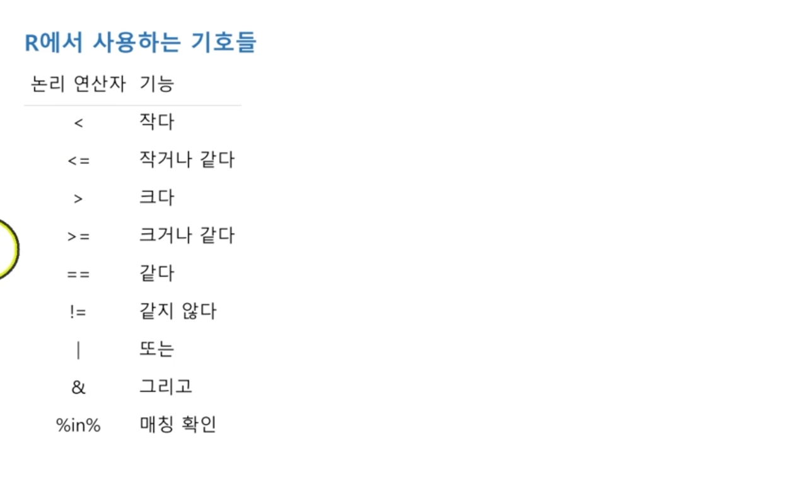

  

  

- ##### Types of Statistics

  

  

  

  

  **Sample -> Population**


​	

- ##### Descrbing the data graphically

  

  

  

  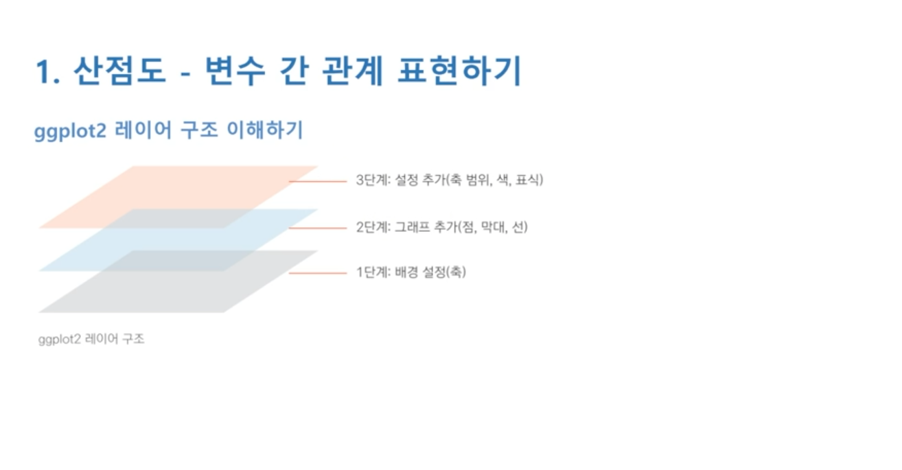

  

  

  

  

  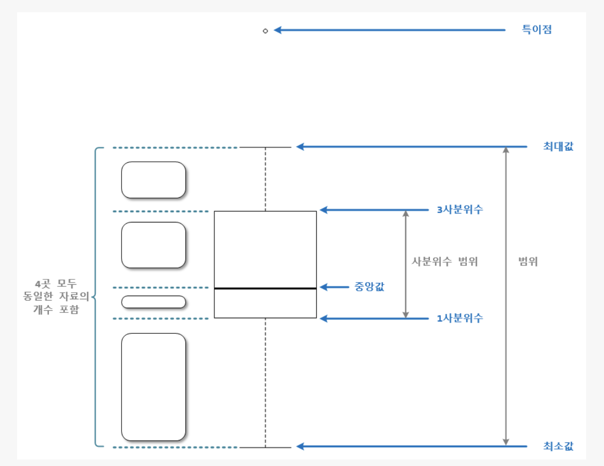

  

  

  


​	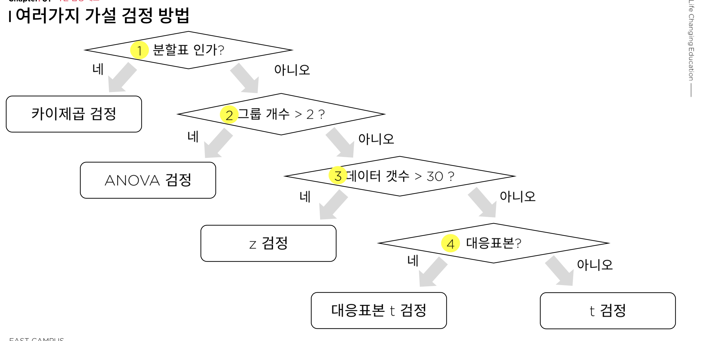

​	

​	


- ##### Measure of Center

  

  

  

  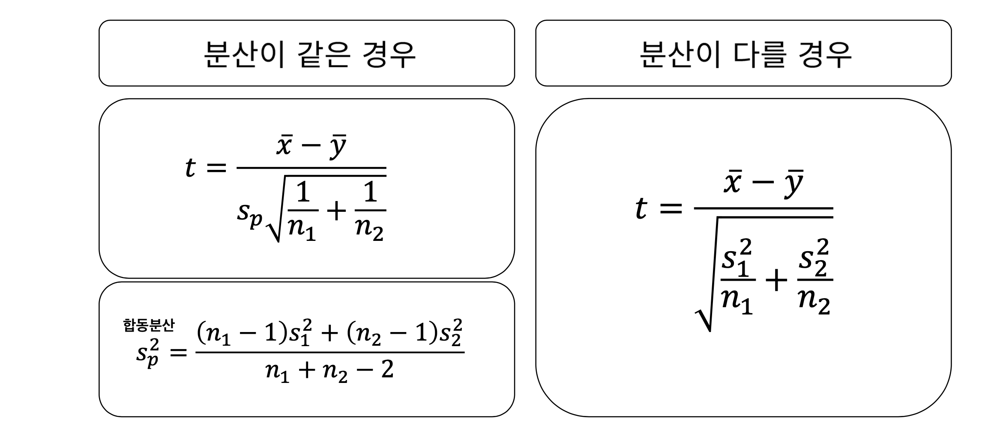

  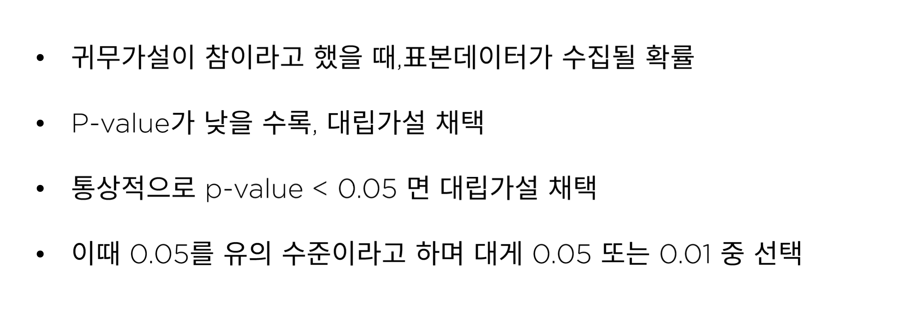

  

  

  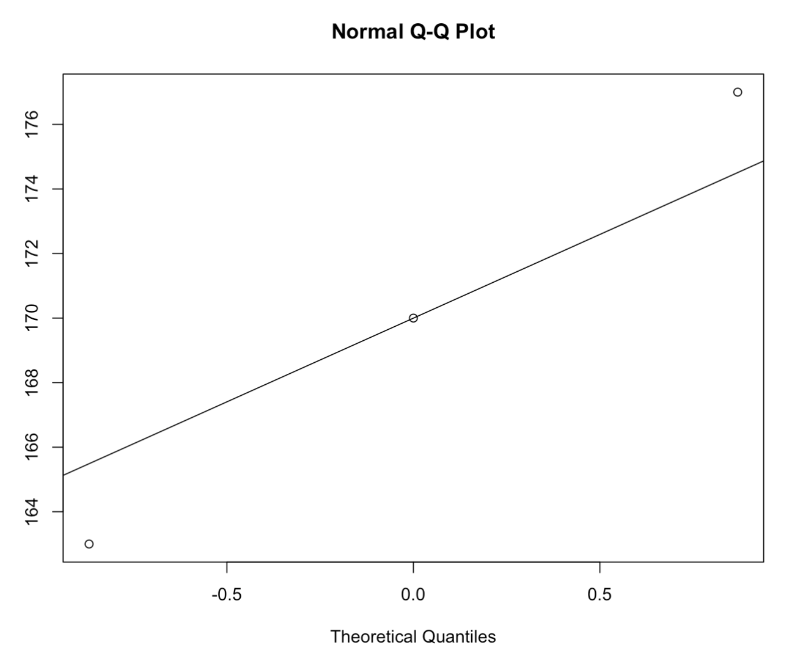

  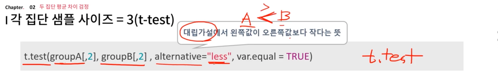

  

  **MidRange**

  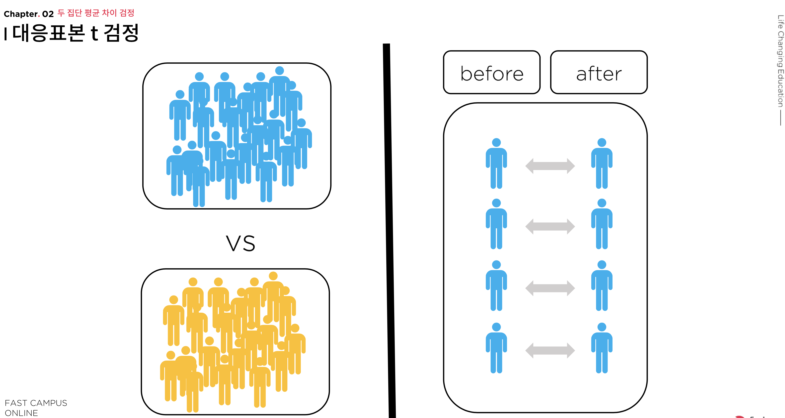

  

  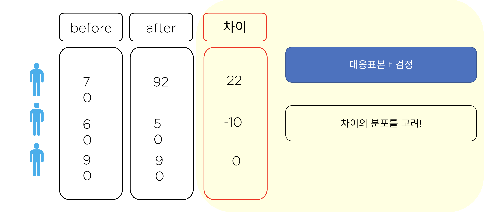


- #### Measures of Dispersion

  

  

  	

  

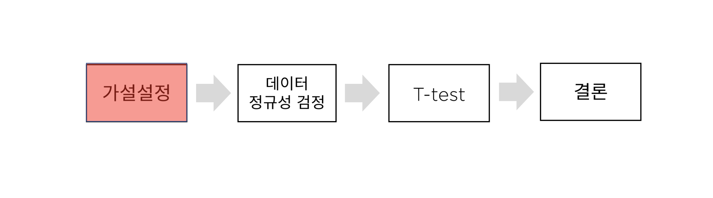

​	

​	

​	
