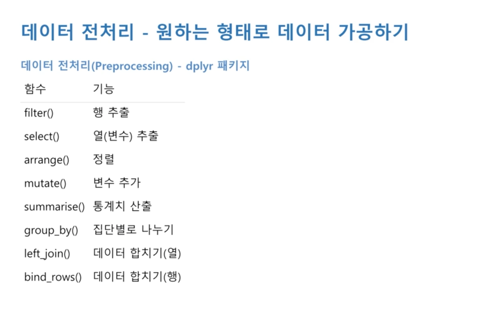
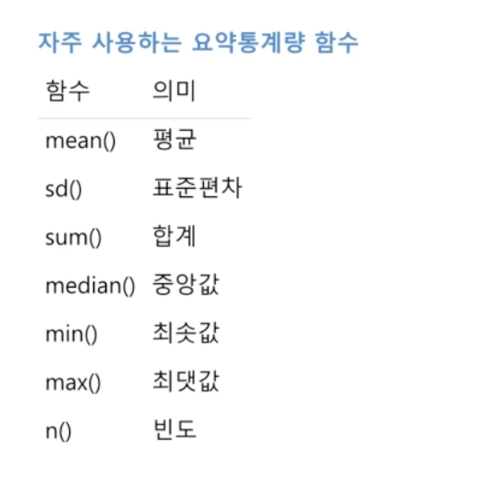

# R

[Chart With R](###Chart)

[결측치 정제하기](####결측치 정제하기)


| Shortcut        | Description              |
| --------------- | ------------------------ |
| Ctrl + L        | Clear the console output |
| option + -      | <-                       |
| command+shift+M | %>%                      |


| Command                                    | Description                                                  |
| ------------------------------------------ | ------------------------------------------------------------ |
| `ls()`                                     | show all values in the workspace                             |
| `rm(X)`                                    | Delete the variable **X**                                    |
| `rm(list=ls())`                            | Delete All variables in the workspace                        |
| `browseURL("http://cran.r-project.org")`   | Open the URL                                                 |
| `install.packages("LiblineaR")`            | install packages                                             |
| `library()`                                | Show all packages installed(available)                       |
| `search()`                                 | Check the currently loaded packages                          |
| `require() vs library()`                   | library와 require는 기본적으로 비슷한 기능을 하지만, require은 패키지가 없을 때 warning을 보여준다. 고로, 함수 내부에서 쓸때 require가 자주 사용됨. |
| `detach("package:LiblineaR", unload=TRUE)` | Unload the package                                           |
| `remove.packages("LiblineaR")`             | remove the package                                           |
| `?? ggplot2`                               | show the docs                                                |
|                                            |                                                              |
|                                            |                                                              |
|                                            |                                                              |


|                    |                                         |      |
| ------------------ | --------------------------------------- | ---- |
| str(iris)          | iris 데이터 프레임의 구조 확인          |      |
| View(df)           | df 새 창에서 크게 보기                  |      |
| table(df$column)   | 해당 컬럼에 대해서 따로 테이블 만들어줌 |      |
| R space Image 저장 | 환경창 변수까지 같이 저장하는 것.       |      |
|                    |                                         |      |
|                    |                                         |      |


## Basic of R

- #### Add Data

  - datasets이라는 패키지가 기본으로 설정되어 있음. 

    `data()` -> datasets라는 패키지 안에 있는 데이터 보여줌. 

    `library(help = "datasets")` 패키지 사용법

    `? iris` datasets패키지랑 같이 기본으로 로드되는 데이터셋이라 이렇게 해도 설명 보여줌. 

    `str(iris)` -> structure of the data frame

    ```R
    # Inputting Data
    require("datasets")
    data()
    ? datasets
    library(help = "datasets")
    ? iris
    str(iris)
    iris
    
    # dataset패키지에서 제공하는 명령어. iris라는 이름으로 내 Workspace에 저장된다. 
    data("iris")
    ```

    

  - Enter Data Manually

    ```R
    # Enter data manually
    
    x1 <- 1:10
    x2 <- c(2, 5, 7, 4)
    x3 <- seq(5, 50, by = 5)
    x3
    x4 <- seq(5, -50, by = -5)
    
    # 콘솔에서 하나씩 추가 가능
    # 다 넣고 enter 두번
    x5 <- scan() 
    ```

    

  - From CSV or Text File

    ```R
    # txt with seperator \t
    setwd("/Users/sanghyuk/Documents/data_science_R/source/")
    Product <- read.table("Data Files/Product.txt", header=TRUE, sep = "\t")
    str(Product)
    
    Customer <- read.csv("Data Files/Customer.csv", header = TRUE)
    str(Customer)
    View(Customer)
    ```


​		


### Data Searching

- ```R
  exam <- read.csv("source/Data/csv_exam.csv", header=TRUE)
  head(exam)
  head(exam, 10)
  tail(exam)
  tail(exam, 10)
  View(exam) # Show data in new tab
  dim(exam) # dimension
  str(exam) # 컬럼 설명
  summary(exam) # 요약통계량
  
  ```


### Data Frame수정 

- 컬럼명 바꾸기

  `rename function is in dplyr package`

  ```
  # # new name : v2, old name = var2
  # df_new <- rename(df_new, v2=var2)
  ```

- 


### 파생 변수 만들기 

- **ifelse, table, qplot**

  ```R
  # Derivative Variable
  df <- data.frame(var1 = c(4, 3, 8), var2 = c(2, 6, 1))
  df$var_sum <- df$var1 + df$var2
  df$var_total <- (df$var1 + df$var2)/2
  df
  
  
  mpg$total <- (mpg$cty + mpg$hwy)/2
  head(mpg)
  mean(mpg$total)
  summary(mpg$total)
  hist(mpg$total)
  
  mpg$test <- ifelse(mpg$total >=20, "pass", "fail")
  
  head(mpg, 20)
  
  # 숫자 세줌
  table(mpg$test)
  library(ggplot2)
  qplot(mpg$test)
  
  mpg$grade <- ifelse(mpg$total >=30, "A", ifelse(mpg$total >=20 , "B", "C"))
  table(mpg$grade)
  qplot(mpg$grade)
  
  
  mpg$grade <- ifelse(mpg$total >=30, "A", ifelse(mpg$total >=20 , "B", ifelse(mpg$total >=10 , "C", "D")))
  mpg$grade
  table(mpg$grade)
  qplot(mpg$grade)
  
  ```

  ```R
  # QUIZ
  midwest <- as.data.frame(ggplot2::midwest)
  str(midwest)
  head(midwest)
  dim(midwest)
  
  midwest <- rename(midwest, total=poptotal, asian=popasian)
  
  midwest$ratio <- (midwest$asian/midwest$total)*100
  hist(midwest$ratio)
  
  mean_ratio <-mean(midwest$ratio)
  midwest$large.small <- ifelse(midwest$ratio > mean_ratio, "large", "small" )
  
  table(midwest$large.small)
  qplot(midwest$large.small)
  
  ```

- **파생 변수 추가할때는, Mutate를 쓰는 것을 권한다**

  Mutate는 내부에서 훨씬 많은 일들을 할 수 있으면서 코드도 훨씬 간결하다. 

  ```R
  # ADD Derivative with Mutate(파생변수 추가)
  # 내장변수
  exam$total <- exam$math + exam$english + exam$science
  # Mutate 
  exam %>% mutate(total = math, english, science) %>%  head
  exam %>% mutate(total = math, english, science, 
                  mean = (math, english, science)/3 ) %>%  head
  
  exam %>% mutate(test = ifelse(science >=6, "pass", "fail")) %>%  head
  
  
  ```

  **지금 가장 중요한 포인트는, 아래 코드에서 total 코드를 실제 exam안에다가  assign한 적이 없어서 아직 변수가 없는 상태인데도, 뒤에서 마치 있는 것처럼 사용이 가능하다는 것.** 

  ```R
  exam %>% mutate(test = ifelse(science >=6, "pass", "fail")) %>%  arrange(total) %>% head
  ```

  **Quiz**

  ```R
  # Quiz
  mpg <- as.data.frame(ggplot2::mpg)
  mpg <-mpg %>% mutate(total = cty+hwy, avg = (cty+hwy)/2)
  mpg %>% arrange(desc(avg)) %>% head(3)
  
  mpg %>% mutate(total = cty+hwy, avg = (cty+hwy)/2) %>%  arrange(desc(avg)) %>%  head(3)
  
  ```

  심지어 mutate에서는, 아직 mutate선언이 끝나지도 않았는데, 앞에서 선언된걸 사용할수가 있음. total처럼. 

  ```R
  mpg %>% mutate(total = cty+hwy, avg = (total)/2) %>%  arrange(desc(avg)) %>%  head(3)
  ```

  

### Data IO

- ```R
  
  # 외부 데이터 가져오기
  install.packages("readxl")
  library(readxl)
  # Excel
  df_finalexam <- read_excel("source/Data/finalexam.xlsx", sheet=1, col_name=T)
  df_finalexam
  mean(df_finalexam$math)
  mean(df_finalexam$history)
  mean(df_finalexam$english)
  
  # CSV
  df_finalexam <- read.csv("source/Data/csv_exam.csv", header=TRUE)
  df_finalexam
  
  # Store
  write.csv(df_finalexam, file="
  ```

  

#### Data Extracting with condition 

- 

  

  ​	

#### Extracting Rows

~~~R
```R
# 조건에 맞는 데이터 추출하기
library(dplyr)
exam <- read.csv("source/Data/csv_exam.csv", header=TRUE)
exam %>% filter(class==1)
exam %>% filter(class==2)
exam %>% filter(class!=3)
exam %>% filter(math  > 50)
exam %>% filter(math  < 50)

exam %>%  filter(class == 2 & english >=80)
exam %>%  filter(class == 2 | english >=80)
exam %>%  filter(class == 2 | class==1 | class==5)
# 여러개 or 연결시 
# match operator
exam %>%  filter(class %in% c(1, 3, 5))

# 추출한 행으로 만들기
class1 <- exam %>%  filter(class == 1)
class2 <- exam %>%  filter(class == 2)
mean(class1$math)
mean(class2$math)
```

Quiz

```R

# Quiz
mpg <-as.data.frame(ggplot2::mpg)
# Q1
displ_4 <- mpg %>% filter(displ <= 4)
displ_5 <- mpg %>% filter(displ > 5)
mean(displ_4$hwy)
mean(displ_5$hwy)

#Q2
str(mpg)
audi <- mpg %>% filter(manufacturer == "audi")
toyota <- mpg %>% filter(manufacturer == "toyota")
mean(audi$cty)
mean(toyota$cty)
~~~


~~~R
# Q3
library(dplyr)
mpg <-as.data.frame(ggplot2::mpg)
mpg  %>% filter(manufacturer %in% c("chevrolet", "ford", "honda"))
cfh <-mpg  %>% filter(manufacturer %in% c("chevrolet", "ford", "honda"))
mean(cfh$hwy)

mpg %>% group_by(manufacturer)
```
~~~

  


#### Extracting Columns/Variables

```R
# 필요한 변수만 추출하기(컬럼 추출)
exam %>% select(math)
exam %>% select(english)
exam %>% select(english, class, math)
# 제외
exam %>% select(-english)
exam %>% select(-english, -math)

```

```R

# 조합
exam %>% 
  filter(class ==1) %>%
  select(english)


exam %>% 
  filter(class ==1) %>%
  select(english) %>% 
  head(5)
```

```R

# QUIZ
cc <- mpg %>% select(class, cty)
str(cc)

suv <-cc %>% filter(class=="suv") %>% select(cty)
compact <-  cc %>% filter(class=="compact") %>% select(cty)

mean(suv$cty)
mean(compact$cty)
```


#### Arange Data 정렬

- ```R
  
  # Arange
  exam %>% arrange(math)
  exam %>% arrange(desc(math))
  
  # Douuble Arange
  exam %>% arrange(desc(class), desc(math))
  
  
  # Quiz
  mpg %>% filter(manufacturer == "audi") %>% arrange(desc(hwy)) %>% head(5)
  
  ```


#### Group By with Summarise

- N은 Count임. 각각 group by 내부 행의 갯수를 서주는 것. 그냥 행 세는 거니깐, 따로 컬럼명 안서도 되겠지. 자주 쓴다. 

  ```R
  exam %>% 
    group_by(class) %>%
    summarise(mean_math = mean(math), sum_math=sum(math), median_math=median(math), n=n())
  
  ```

- 

- 여러번 쪼갤 수도 있다. 

  ```R
  
  mpg %>% 
    group_by(manufacturer, drv) %>% 
    summarise(mean_city = mean(cty)) %>% 
    head(10)
  
  ```

  

  **Quiz**

  ```R
  # QUIZ
  mpg <- as.data.frame(ggplot2::mpg)
  # Q1
  mpg %>% group_by(class) %>% summarise(avg_cty = mean(cty))
  
  # Q2
  mpg %>% group_by(class) %>% summarise(avg_cty = mean(cty)) %>% arrange(desc(avg_cty))
  
  # Q3
  mpg %>% group_by(manufacturer) %>%  summarise(avg_cty = mean(cty)) %>% arrange(desc(avg_cty)) %>% head(3)
  
  # Q4
  mpg %>% filter(class=="compact") %>%  group_by(manufacturer) %>%  summarise(n=n()) %>% arrange(desc(n))
  아래 방식도 답이 똑같이 나오긴 하는데, 위 코드가 더 논리적임. 
  
  mpg %>% 
    group_by(manufacturer) %>% 
    filter(class=="compact") %>% 
    summarise(n=n())
  
  ```


#### 데이터  합치기 merge

- 

  ​	

  		

- ```R
  
  # 데이터  합치기 merge
  test1 <- data.frame(id=c(1,2,3,4,5), midterm=c(60,80,70,90,85))
  test2 <- data.frame(id=c(1,2,3,4,5), midterm=c(70,83,65,95,80))
  
  # 가로 합치기
  total <- left_join(test1, test2, by="id")
  total
  
  name <- data.frame(class=c(1,2,3,4,5), teacher=c("KIM", "SON", "LEE", "PARK", "YOON"))
  left_join(exam, name, by="class")
  
  
  # 세로 합치기
  group_a <- data.frame(id=c(1, 2, 3, 4, 5), test=c(60, 80, 70, 90, 85))
  group_b <- data.frame(id=c(6, 7, 8, 9, 10), test=c(70, 83, 65, 95, 80))
  
  group_all <- bind_rows(group_a, group_b)
  group_all
  ```

- Quiz

  ```R
  # Quiz
  mpg <- as.data.frame(ggplot2::mpg)
  fuel <- data.frame(fl = c("c", "d", "e", "p", "r"), 
                     price_fl = c(2.35, 2.38, 2.11, 2.76, 2.22), stringsAsFactors = F)
  
  str(mpg)
  str(fuel)
  # Q1
  left_join(mpg, fuel, by="fl")
  
  # Q2
  left_join(mpg, fuel, by="fl") %>% select(model, fl, price_fl) %>% head(5)
  ```

  

  

### Chart

- Basic ggplot2

  **qpot은 전처리 단계에서 간단하게 데이터 확인할대 쓰는 것. ggplot2가 최종 보고용.** 

  

  

- #### Scatter Plot

  **X, Y축 모두가 Continuous variable 일 때 사용**

  xlim, ylim이 default는 최대, 최소를 다 표현함. 그래서 보통은 xlim/ylim을 꼭 제한 해줘야 함.  

  ```R
  # Scatter Plot 
  # Two continuous variable
  library(ggplot2)
  
  ggplot(data=mpg, aes(x=displ, y=hwy)) + 
    geom_point() +
    xlim(3, 6) + 
    ylim(10, 30)
  
  #Quiz
  # 1
  ggplot(data=mpg, aes(x=cty, y=hwy)) + 
    geom_point()
  
  # 2
  midwest <- as.data.frame(ggplot2::midwest)
  ggplot(data=midwest, aes(x=poptotal, y=popasian)) +
    geom_point() +
    xlim(0, 500000) + 
    ylim(0, 10000)
  
  ```


- **Barplots in R**

  평균막대그래프와 빈도막대그래프 두 종류가 있음.

  **평균막대그래프** - 각 집단의 평균값을 막대 길이로 표현한 그래프. 

  일단 평균 테이블을 만들어야 함. 

  ```R
  library(dplyr)
  df_mpg <- mpg %>%
    group_by(drv) %>% 
    summarise(mean_hwy = mean(hwy))
  df_mpg
  ```

  ```R
  ggplot(data=df_mpg, aes(x=reorder(drv, -mean_hwy), y=mean_hwy)) + 
    geom_col() 
  ```

  ggplot(data=df_mpg,` aes(x=reorder(drv, -mean_hwy), y=mean_hwy))`, -> `x의 drv를 -mean_hwy의 역순으로 정렬하겠다. `

  **빈도막대그래프**

  ```R
  # Frequency Bar Plot
  # y를 안넣어주고, geom_bar를 하면, y축이 자동으로 Frequency가 된다. 
  ggplot(data=mpg, aes(x=drv)) + geom_bar()
  
  ```

  

  

  

  ```R
  
  # Creating Barplot with R
  y <- table(Customer$Region)
  View(y)
  
  #Y axis means Frequency
  barplot(y)
  y[order(y)]
  #Order by frequency
  barplot(y[order(y)])
  barplot(y[order(-y)])
  #horizontally
  barplot(y[order(y)], horiz=TRUE)
  
  # Appeance of Bar plot
  barplot(y[order(y)], horiz=TRUE, col="red")
  barplot(y[order(y)], horiz=TRUE, col=c("red", "green", "blue", "beige"))
  
  # can see all list of colors available
  colors()
  colors()[3]
  
  # remove the black boundary
  barplot(y[order(y)], horiz=TRUE, col=c("red", "green", "blue", "beige"), border=NA)
  
  # add title
  barplot(y[order(y)], horiz=TRUE, col=c("red", "green", "blue", "beige"), border=NA, main = "Title \n of this \n Bar char")
  
  
  # lable the x axis and y axis
  barplot(y[order(y)], horiz=TRUE, col=c("red", "green", "blue", "beige"), border=NA, main = "Title \n of this \n Bar char", xlab="X AXIS TITLE", ylab="Y AXIS TITLE")
  ```
  

  

  PNG로 저장하기 with command

  ```R
  # To make this bar plot image file
  # click the export above the image
  # also has command
  png(filename = "./Freq.png", width=888, height=377)
  barplot(y[order(y)], horiz=TRUE, col=c("red", "green", "blue", "beige"), border=NA, main = "Title \n of this \n Bar char", xlab="X AXIS TITLE", ylab="Y AXIS TITLE")
  dev.off()
  ```

- #### Line Graph

  ```R
  # Line Graph
  ggplot(data=economics, aes(x=date, y=unemploy)) + geom_line()
  ggplot(data=economics, aes(x=date, y=psavert)) + geom_line()
  ```


- #### Box Plot

  평균으로만 비교할 순 없다. 

  

  

  ​	

  ```R
  
  # Box Plot
  ggplot(data=mpg, aes(x=drv, y=hwy)) + geom_boxplot()
  
  # Quiz
  mpg_com <- mpg %>%
    filter(class %in%  c("compact", "subcompact", "suv"))
    
  ggplot(data=mpg_com, aes(x=class, y=cty)) + geom_boxplot()
  ```

  

  

  

  

  


- Histogram in R

  ```R
  
  # Histogram IN R
  # 11 bucket by default
  hist(Customer$Age)
  
  # 5 bucket
  # 딱 5개만 나오는 것은 아님. around 5로 해주는 것.
  hist(Customer$Age, breaks = 5)
  
  # suggesting the range
  hist(Customer$Age, breaks = c(0, 40, 60, 100))
  
  
  # 위에서는 density로 나옴. 
  # freq = True(빈도), freq=False(확률 밀도)
  hist(Customer$Age, breaks = c(0, 40, 60, 100), freq=TRUE)
  
  hist(Customer$Age, breaks = c(0, 40, 60, 100), freq=TRUE, col="blue")
  hist(Customer$Age, breaks = c(0, 40, 60, 100), freq=TRUE, col="blue", main="Histogram of Age")
  ```

  


#### 결측치 정제하기

- 확인하기

  ```R
  is.na(df)
  
  # 테이블 만들어서 확인
  table(is.na(df))
  
  
  # 열별로 결측치 확인해봐야함. 
  table(is.na(df$sex))
  table(is.na(df$score))
  
  ```

- 결측치 제외. 

  score컬럼이 결측치가 아닌 것을 지우자.

  ````R
  df %>% filter(!is.na(score))
  ````

  컬럼 둘다 지우려면, &으로 연결하면 되지. 

  ```R
  df_nomiss <-df %>% filter(!is.na(score) & !is.na(sex))
  df_nomiss
  
  ```

  근데 변수가 100개면?

  결측치 싹다 없애주는 함수가 있음. 근데 실제로는 잘 쓰지 않는다. 

  데이터 손실이 너무 큼. 보통은 변수 하나씩, 한다. 

  ```R
  df_nomiss2 <- na.omit(df)
  df_nomiss2
  ```

  요약통계량 구할 때 편한 함수. 이 파라미터 지원하는 함수도 있고, 없는 함수도 있다. 

  ```R
  mean(df$score, na.rm=T)
  ```

  summarise 안에 들어갈때도 사용 가능. 

  ```R
  exam <- read.csv("source/Data/csv_exam.csv", header=TRUE)
  
  
  # math컬럼의 3,8,15행에 NA넣기
  exam[c(3, 8, 15), "math"] <- NA
  
  exam %>% 
    summarise(mean_math = mean(math))
  
  exam %>% 
    summarise(mean_math = mean(math, na.rm=T))
  ```

- **결측치 대체하기**

  보통은 대푯값(mode, mean, median)등으로 함. 하지만, 요즘은 머신러닝 모형으로, 주변 변수활용해서 이 변수 춪어한 다음에 그 값을 넣기도 한다

  ```R
  mean(exam$math, na.rm=T)
  exam$math <- ifelse(is.na(exam$math), 55, exam$math)
  ```

  ````R
  
  # Quiz
  mpg <- as.data.frame(ggplot2::mpg)
  mpg[c(65, 124, 131, 153, 212), "hwy"] <- NA
  
  # 1
  table(is.na(mpg$drv))
  table(is.na(mpg$hwy))
  
  # 
  mpg %>% filter(!is.na(mpg$hwy)) %>% 
    group_by(class) %>% 
    summarise(mean_hwy = mean(hwy)) %>% 
    arrange(desc(mean_hwy))
  
  ````

  

- 이상치

  - 논리적으로 존재할 수 없는 경우, etc) 성별에 G

    1. 빈도분석으로 확인
    2. 이상치의 경우 ,NA로 바꾼 후 나중에 빼거나 바꿔준다. 

    ```R
    # Outlier 
    # 논리적으로 존재할 수 없는 경우 
    outlier <- data.frame(sex=c(1, 2, 1, 3, 2, 1), 
                          score=c(5, 4, 3, 4, 2, 6))
    
    # 이상치 체크 
    table(outlier$sex) # 1 or 2
    table(outlier$score) # 1 ~ 5
    
    outlier$sex <- ifelse(outlier$sex ==3, NA, outlier$sex)
    outlier$score <- ifelse(outlier$score > 5, NA, outlier$score)
    table(is.na(outlier$sex))
    table(is.na(outlier$score))
    
    outlier %>% 
      filter(!is.na(outlier$sex) & !is.na(outlier$score)) %>% 
      group_by(sex) %>% 
      summarise(mean_score = mean(score))
    
    ```

  - 극단적으로 크거나 작은 경우

    보통은 박스플롯 혹은, 2표준편차 등으로 사용. 

    ```R
    # 극단적인 값. 
    mpg <- as.data.frame(ggplot2::mpg)
    boxplot(mpg$hwy)
    boxplot(mpg$hwy)$stats # box plot의 각 선들 찾아줌.
    
    mpg$hwy<-  ifelse(mpg$hwy < 12 | mpg$hwy >37, NA, mpg$hwy)
    table(is.na(mpg$hwy))
    
    
    mpg %>%
      group_by(drv) %>%
      summarise(mean_hwy = mean(hwy, na.rm = T))
    
    ```

    Quiz

    ```R
    # Q
    mpg <- as.data.frame(ggplot2::mpg)
    mpg[c(10, 14, 58, 93), "drv"] <- "k"
    mpg[c(29, 43, 129, 203), "cty"] <- c(3, 4, 39, 42)
    
    
    table(mpg$drv)
    mpg$drv <- ifelse(mpg$drv %in% c("4", "f", "r"), mpg$drv, NA)
    table(mpg$drv)
    
    boxplot(mpg$cty)$stats #9, 26
    mpg$cty <-  ifelse(mpg$cty < 9 | mpg$cty > 26, NA,  mpg$cty)
    boxplot(mpg$cty)
    
    mpg %>% 
      filter( !is.na(drv) & !is.na(cty)) %>% 
      group_by(drv) %>% 
      summarise(mean_cty = mean(cty, na.rm=TRUE))
    
    ```

- #### 한국복지패널

  ```R
  
  # source/Data/data_spss_Koweps2014.sav
  
  install.packages("foreign")
  library(foreign)
  library(dplyr)
  library(ggplot2)
  
  raw_welfare <- read.spss("source/Data/data_spss_Koweps2014.sav", to.data.frame = T)
  welfare <-raw_welfare
  
  # first look
  dim(welfare)
  str(welfare)
  head(welfare)
  summary(welfare)
  View(welfare)
  
  welfare <- rename(welfare, 
                    sex=h0901_4,
                    birth=h0901_5,
                    income=h09_din)
  
  
  # Preprocessing
  # sex
  class(welfare$sex)
  summary(welfare$sex) # meaningless
  table(welfare$sex)
  table(!is.na(welfare$sex))
  
  welfare$sex <- ifelse(welfare$sex == 1, "male", "female")
  table(welfare$sex)
  qplot(welfare$sex)
  
  # income 
  class(welfare$income)
  summary(welfare$income)
  boxplot(welfare$income)
  qplot(welfare$income) + xlim(0, 10000)
  
  table(!is.na(welfare$income))
  
  # age
  class(welfare$birth)
  summary(welfare$birth)
  qplot(welfare$birth)
  
  table(!is.na(welfare$birth))
  
  welfare$age <- 2014 - welfare$birth + 1
  summary(welfare$age)
  qplot(welfare$age)
  
  
  
  # Analysis
  # 1 Gender & Income
  sex_income <- welfare %>% 
    group_by(sex) %>% 
    summarise(mean_income = mean(income))
  sex_income
  ggplot(data=sex_income, aes(x=sex, y=mean_income)) + geom_col()
  
  
  
  
  # 2. Age & Income
  age_income <-   welfare %>% 
    group_by(age) %>% 
    summarise(mean_income = mean(income))
  ggplot(data=age_income, aes(x=age, y=mean_income)) + geom_point()
  
  welfare <- welfare %>% 
    mutate(ageg = ifelse(age <30, "young", ifelse(age <=59, "middle", "old")))
  
  table(welfare$ageg)
  qplot(welfare$ageg)
  
  welfare_income <- welfare %>% 
    filter(ageg != "young") %>% 
    group_by(ageg) %>% 
    summarise(mean_income = mean(income))
  
  ggplot(data=welfare_income, aes(x=ageg, y=mean_income)) + geom_col()
  
  
  # 연령대 및 성별에 따른 소득
  sex_income <- welfare %>% 
    filter(ageg != "young") %>% 
    group_by(ageg, sex) %>% 
    summarise(mean_income = mean(income))
  
  sex_income$sex <-  ifelse(sex_income$sex == 1, "male", "female")
  
  #default is stack
  ggplot(data=sex_income, aes(x=ageg, y=mean_income, fill=sex)) + geom_col(position="stack") 
  ggplot(data=sex_income, aes(x=ageg, y=mean_income, fill=sex)) + geom_col(position="dodge")
  
  
  ```

  
