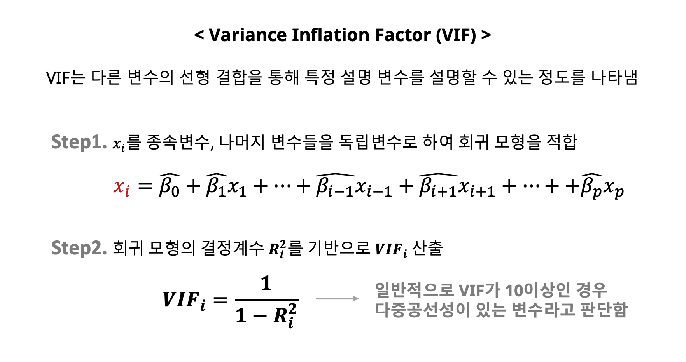
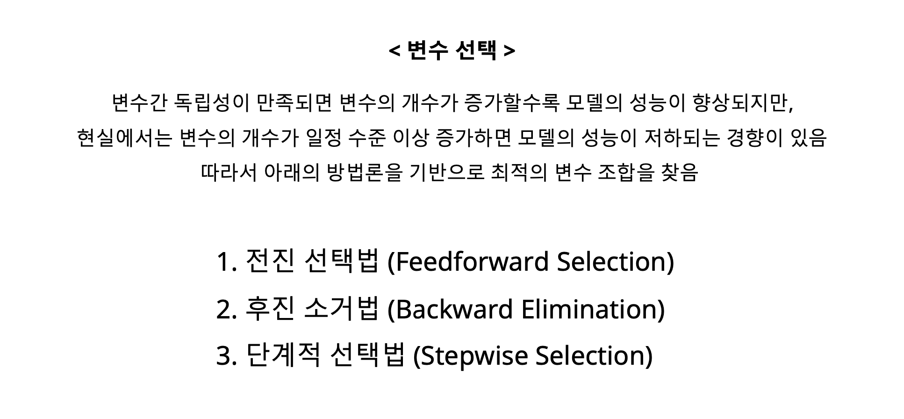

# Linear Regression

[Background Konledge](#Background Knowledge)

[Linear Regression Part](#2. Linear-Regression)

# Background Knowledge

- #### 머신러닝이란?

  

  ​		

  

  

- #### 확률의 기초

  

  

  

  ​	

  

  

  

  ##### 	통계적 추론

  ​	

  

  

  

  

- #### MLE

  표본을 가지고, 관측치가 나올 확률이 가장 큰 모수를 구하는 것. 가장 많이 쓰는 방법론. 

  

  ​	

  시그마는 알려졌다고 가정하네. 

  

  ​	

  

- #### Matrix 미분

  

  ​	

  

#2. Linear-Regression

- 

  

  모집단의 회귀식(신의 입장) - 우리는 샘플을 보고 최대한 유사하게 이것을 추정하는 것. 

  

  

- #### 단순선형 회귀계수 추정

  

  

  **Gradient Vector**

  

  

  

  

  

  

- #### 단순선형회귀모형의 해석 및 검정

  

  

- #### 회귀 모형 적합도 평가

  

  

  ***아래서 P가 변수의 갯수, N은 데이터의 갯수***

  **정확히는 오차(입실론)에 대한 가정이다. 잔차는 오차에 대한 추정치**

  첫번째 잔차 플롯에서, 이게 어떤 트랜드를 가지면 안된다는 것. 랜덤하게 존재해야 한다. 

  두번째는 정규성에 대한 판단. 

  

- #### 다중 선형회귀의 개요

  

  

  

  

  

  

  

- #### 다중 공선성 개념 이해 및 진단 방법

  

  ​	

  ​	

  ​	

- #### 회귀모형의 성능평가지표

  

  

  

  

- #### 변수 선택법

  **현실에서는 모든 변수가 싹다 독립성이 만족되고 이러기가 굉장히 어렵기 때문에, 변수가 계속 증가하면 성능이 저하되는 경향이 있다.** 

  

  

**AIC/BIC둘다 모델이 얼마나 좋은지 판단하는 기준일 뿐.** 

​	하나씩 넣어보면서, AIC라고 하면 그거 하나씩 계속 넣어가면서 AIC선택하고 계속 무한 반복하는거야. 어느 순간 추가적인 것을 넣기 시작하니깐, AIC가 	안올라가면 stop. 

 

​	

​	

전진/후진 모두 한번 날린 변수는 다시 쓰질 않아. 애매하지. back/forward 계속 해보라는거야. 결국은 노가다여. 